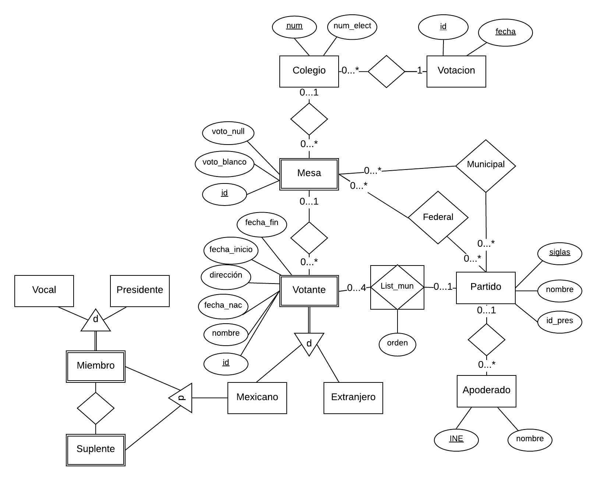

# Tarea 1. SQL Avanzado

---

##### Integrantes:
1. *Gabriel Schlam Huber* - *A01024122* - *Santa Fe*
2. *Eduardo Harari* - *A01025876* - *Santa Fe*
3. *Diego Alejandro Moreno Acevedo* - *A01022113* - *Santa Fe*
---
## 1. Aspectos generales

Las orientaciones de la tarea se encuentran disponibles en la plataforma **Canvas**.

Este documento es una guía sobre qué información debe entregar como parte de la tarea, qué requerimientos técnicos debe cumplir y la estructura que debe seguir para organizar su entrega.


### 1.1 Requerimientos técnicos

A continuación se mencionan los requerimientos técnicos mínimos de la tarea, favor de tenerlos presente para que cumpla con todos.

* El equipo tiene la libertad de elegir las tecnologías de desarrollo a utilizar en la tarea, sin embargo, debe tener presente que la solución final se deberá ejecutar en una plataforma en la nube. Puede ser  [Google Cloud Platform](https://cloud.google.com/?hl=es), [Azure](https://azure.microsoft.com/en-us/), AWS [AWS](https://aws.amazon.com/es/free/) u otra.
* El equipo tiene la libertad de utilizar el DBMS de su preferencia.
* La arquitectura de la solución deberá estar separada claramente por capas (*frontend*, *backend*, datos y almacenamiento).
* Todo el código, *scripts* y la documentación de la tarea debe alojarse en este repositorio de GitHub, siguiendo la estructura que aparece a continuación.

### 1.2 Estructura del repositorio

El proyecto debe seguir la siguiente estructura de carpetas:
```
- / 			        # Raíz de toda la tarea
    - README.md			# Archivo con la información general de la tarea (este archivo)
    - frontend			# Carpeta con la solución del frontend (Web app)
    - backend			# Carpeta con la solución del backend en caso de ser necesario (CMS o API)
    - scripts		        # Carpeta con los scripts necesarios para generar la base de datos, cargar datos y ejecutar las consultas
    - database			# Carpeta con el diagrama Entidad-Relación Extendido y los archivos CSV de datos necesarios para generar la bases de datos

```

### 1.3 Documentación de la tarea

Como parte de la entrega de la tarea, se debe incluir la siguiente información:

* Diagrama del *Modelo Entidad-Relación Extendido*.
* *Scripts* para generar la base de datos, cargar datos y ejecutar consultas.
* Archivos CSV con los datos a cargar en al base de datos.
* Guía de configuración, instalación y despliegue de la aplicación en la plataforma en la nube  seleccionada.
* El código debe estar documentado siguiendo los estándares definidos para el lenguaje de programación seleccionado.

## 2. Solución

A continuación aparecen descritos los diferentes elementos que forman parte de la solución de la tarea.

### 2.1 Modelo de la *base de datos* 



Nuestra implementación para nuestra base de datos incluye las entidades siguientes, con sus respectivas relaciones y/o restricciones:
1. **Colegio:**
	* Relación con:
		* Mesa
		* Votación
	* Jerarquías:
		* Mesa: 1 a muchos, es decir, un colegio tiene 1 o más mesas.
		* Votación: 1 a muchos, es decir, un colegio tiene 1 o más votaciones.
2. **Mesa:**
	* Relación con:
		* Colegio (previamente mencionada).
		* Votante
		* Partido:
			* Aquí existen 2 relaciones:
				* Elecciones municipales.
				* Elecciones federales.
	* Jerarquías:
		* Votante: 1 a muchos, es decir, una mesa tiene 1 o más votantes.
		* Partido: muchos a muchos, ya que una mesa tiene muchos votos por diferentes partidos, y un partido tiene muchos votos en diferentes mesas.
3. **Partido:**
	* Relación con:
		* Mesa (previamente mencionada).
		* Votante.
		* Apoderado.
	* Jerarquías:
		* Votante: 
			* 0 a 4.
			* Aquí existe una restricción, ya que cada partido tiene una lista nominal a la que pertenecen únicamente 4 votantes.
		* Apoderado: 1 a muchos, es decir, un partido tiene 1 o más apoderados.
4. **Votante:**
	* Relación con:
		* Partido (previamente mencionada).
		* Mesa (previamente mencionada).
	* Restricciones:
		* Un votante puede ser: Mexicano o Extranjero.
		* Si es Mexicano, tiene las siguientes opciones:
			* Ser un votante común.
			* Ser un miembro:
				* Vocal
				* Presidente
			* Ser un suplente de los puestos anteriores.

***Las demás entidades ya fueron mencionadas y explicadas***

### 2.2 Arquitectura de la solución

*[Incluya aquí un diagrama donde se aprecie la arquitectura de la solución propuesta, así como la interacción entre los diferentes componentes de la misma.]*

### 2.3 Frontend

Para el Frontend se utilizo el lenguaje de HTML, JAVASCRIPT y CSS. Se utilizo Bootstrap para apoyarnos en el diseño y complementar la pagina web. 
Bootstrap es una herramienta muy poderosa que tiene su propio diseño al insertar pedazos de código basados en HTML. Con Bootstrap se crearon los botones, así como el estilo de las letras, los TextBox etc. 
https://getbootstrap.com/docs/4.4/getting-started/introduction/ En este link podemos encontrar la documentación de Bootstrap así como los paso para poder trabajar con el de la mejor manera.

por otro lado se uso HTML, uno de los lenguajes más usados para la implementación de paginas web.
Más adelante se encuentra un link sonde podemos ver algunos detalles sobre este lenguaje y lo que es capaz de hacer.
https://www.w3schools.com/html/ En esta pagina podemos encontrar gran variedad de tutoriales así como ejemplos sobre una  gran parte de los lenguajes que usamos como HTML, CSS y JavaScript.


#### 2.3.1 Lenguaje de programación
HTML, CSS, JAVASCRIPT

#### 2.3.2 Framework
Bootstrap

#### 2.3.3 Librerías de funciones o dependencias
Node

### 2.4 Backend

En este caso, no se usa Backend como tal, todo se implementa en el frontend.
Lo único que podría ser considerado Backend es la utilización de una Base de Datos en el sistema DB2, implementado en un contenedor en Docker.

#### 2.4.1 Lenguaje de programación
SQL en DB2.

#### 2.4.2 Framework
Docekr

#### 2.4.3 Librerías de funciones o dependencias
Node

## 2.5 Pasos a seguir para utilizar la aplicación

1. **Instalación y configuración de Docker:**
		1.  *Instalar Docker:*
			[Docker para Mac](https://docs.docker.com/docker-for-mac/install/)
			[Docker para Windows](https://docs.docker.com/docker-for-windows/install/)
			[Docker para Ubuntu](https://docs.docker.com/install/linux/docker-ce/ubuntu/)
		2. *Descargar la imagen del contenedor de IBM DB2*
		<code>docker pull ibmcom/db2</code>
2. **Instalación de Node:**
		[Install node](https://nodejs.org/)
3. **Creación de Base de Datos en Docker, DB2:**
		1.  *Ejecutar un contenedor con IBM DB, creando una Base de Datos con nombre **"elec"***
		<code>docker run -itd --name elect --privileged=true -p 50000:50000 -e LICENSE=accept -e DB2INST1_PASSWORD=elecc -e DBNAME=**elec** ibmcom/db2 bash</code>
		2. *Conectarse al contenedor*
		<code>docker exec -ti mydb2 bash -c "su - db2inst1"</code>
		3. Ingrese el comando: <code>db2</code>
		4. Copie y pegue el contenido del script *[database_elec.sql](scripts/database_elec.sql)* para crear la Base de Datos y sus respectivas tablas.
		5. Copie y pegue el contenido del script *[inserts_elec.sql](scripts/inserts_elec.sql)* para insertar los datos en la Base de Datos.
		6. Copie y pegue el contenido del script *[updates_elec.sql](scripts/updates_elec.sql)* para actualizar ciertos los datos en la Base de Datos.
		7. Copie y pegue el contenido del script *[deletes_elec.sql](scripts/deletes_elec.sql)* para eliminar ciertos los datos en la Base de Datos.
4. **Instalación de Node en DB2:**
		1. *Instalar el paquete de ibm_db*
			<code>npm install ibm_db</code>
		2. *Ingresar a Docker*
		3. *Ejecute el siguiente comando:*
			<code>su - db2inst1</code>
		4. *Después los siguientes comandos:*
		<code>db2 connect to elec
					db2 "bind @db2cli.lst blocking all sqlerror continue grant public CLIPKG 30" </code>
		5. Ahora entre al contenedor con el comando: <code>db2</code>
5. **Explicación de la página web:**
	* Dentro de la pagina web se tienen dos columnas principales la cuales están nombradas como "Home" y "View Tables". 
	* En la pestaña principal "Home" aparecen unos cuadros dentro de los cuales se podrán ingresar datos correspondientes para cada tabla. 
	* Por ejemplo, la primera tabla que se tiene es la de Tabla Votación la cual tiene 2 TextBox: *ID* y *Fecha*.
	* Dentro de estos 2 recuadros se tiene que ingresar el ID correspondiente de la votación y la fecha de la misma. 
	* Ya teniendo estos 2 datos arriba del recuadro tenemos 3 botones los cuales están nombrados con los nombres. *INSERT*, *UPDATE*, *DELETE*. 
	* Como dice el nombre, después de ingresar los datos se elige la opción que deseemos y se la de click al botón y tus datos en ese momento serán insertados a la tabla, actualizados o borrados.
	* El mismo paso se utilizara para cualquier tabla donde el usuario quiera hacer operaciones CRUD.
	* Dentro de la segunda pagina "View Tables" como lo dice su nombre es para visualizar completas las tablas, es decir, a la hora de elegir una tabla, internamente se corre el query *"SELECT (ciertos atributos) FROM NOMBRE_TABLA"* y se visualiza en pantalla donde el usuario podrá ver los cambios correspondientes que hizo con operaciones CRUD o simplemente ver la tabla completa sin insertar ninguna fila.

>**NOTA**
Se logró conectar la Base de Datos de DB2 con Node, pero al intentar implementar la conexión de Node con html, no se logró que se puedan desplegar la información de la misma hacia la página.
Después se intentó con .EJS, pero lamentablemente se obtuvo el mismo resultado.


## 3. Referencias
https://www.w3schools.com/html/
https://www.ibm.com/developerworks/data/library/techarticle/0309thakrar/0309thakrar.html
https://www.ibm.com/support/knowledgecenter/SSEPGG_9.7.0/com.ibm.swg.im.dbclient.python.doc/doc/t0054368.html
https://stackoverflow.com/questions/6044326/how-to-connect-python-to-db2
https://www.ibm.com/support/pages/sql0805n-package-nullidsysln303-was-not-found
https://www.npmjs.com/package/ibm_db
https://stackoverflow.com/questions/4720343/loading-basic-html-in-node-js
https://developer.ibm.com/mainframe/2019/08/07/accessing-ibm-db2-on-node-js/
